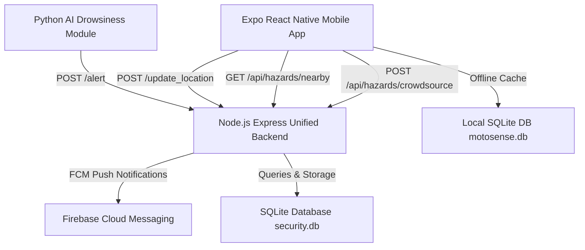

# 🚨 AI DRIVING SAFETY & MOTOSENSE ROAD HAZARD SYSTEM

An end-to-end production-grade **AI Driving Safety System** integrated with the **MotoSense Context-Aware Road Hazard Module**.

The system continuously monitors driver alertness using computer vision, detects drowsiness or sleep state (>6 seconds eyes closed), dispatches emergency alerts to nearby users (<300m) and police stations (<3km), evaluates upcoming road hazards using **Uber H3 Spatial Grid Indexing (Resolution 8)**, and delivers real-time **Text-To-Speech (TTS) voice warnings** and **100% Free OpenStreetMap** visual alerts on a React Native Expo Mobile App.

---

## 📌 System Architecture & Key Features



### 1. 🐍 Python AI Drowsiness Detection (`detection.py`)
* **Computer Vision**: Powered by OpenCV & MediaPipe 3D Face Landmarker.
* **Eye Aspect Ratio (EAR)**: Precise mathematical calculation of eye closure.
* **Head Pose Estimation (PnP)**: Detects head tilting down or looking away.
* **Local Audio Alarm**: Plays immediate audio warning using Pygame.
* **Backend Alert Dispatch**: Automatically posts `POST /alert` with driver ID and GPS coordinates (`lat`, `lon`) when eyes remain closed for **>6 seconds**.
* **Spam Prevention / Debouncing**: Implements a 15-second alert cooldown timer to prevent spamming backend requests.

### 2. ⚡ Node.js Express Unified Backend (`backend/`)
* **Consolidated Server (`server.js`)**: Runs on `http://127.0.0.1:5000`.
* **Unified SQLite Database (`db/database.js`)**: Manages `users`, `police_stations`, `alerts_log`, `fcm_tokens`, and `hazards` in `security.db`. Pre-seeded with demo records.
* **Uber H3 Spatial Grid Indexing (`services/hazardService.js`)**:
  * Resolves GPS coordinates into Uber H3 Resolution 8 spatial cells.
  * **Hazard Aging Stages (`calculate_stage`)**:
    * **Stage 1**: New severe hazards (<14 days) or perpetual Road Construction work.
    * **Stage 2**: Aging hazards (14-30 days) or minor hazards.
    * **Stage 3**: Old hazards (>30 days).
  * **Rider Action Evaluator (`evaluate_rider_action`)**:
    * `FORCE_ALARM`: Mandatory voice & visual alarm (Stage 1, unlit night-time hazards, or first-time riders).
    * `SPEED_GATED_ALARM`: Warning issued only if rider speed exceeds safe threshold.
* **Notification Service (`services/notificationService.js`)**: Dispatches push notifications via Firebase Admin / FCM.

### 3. 📱 Expo React Native Mobile App (`mobile/`)
* **100% Free OpenStreetMap (`src/components/OSMMapView.tsx`)**: Renders custom Leaflet markers for Potholes (orange), Speed Breakers (yellow), Construction (purple), Accidents (red), Blocked Roads (grey), Danger Zones (dark red), Drowsy Driver (red with 300m danger circle), Police (blue), and Users (green). **NO Google Maps API Key required!**
* **Road Hazards Manager (`src/app/hazards.tsx`)**: Tabbed UI for reporting crowdsourced hazards, viewing active grid hazards, and registering/withdrawing contractor roadwork zones.
* **Proximity & Voice Warning Engine (`src/app/location.tsx`)**:
  * Real-time speedometer telemetry.
  * Dynamic Warning Buffer based on speed: `buffer = max(30, speed * 3.5)` in meters.
  * Directional Flashlight Cone Math (±30° tolerance angle ahead).
  * Text-To-Speech audio warnings using `expo-speech` ("Warning, pothole ahead!").
  * Simulated Auto-Drive Mode (40 km/h route test).
* **Offline Local SQLite Caching (`src/services/db.ts`)**: Caches hazard data in local `motosense.db` using `expo-sqlite` with web fallback.

---

## 📁 Project Directory Structure

```
AI_driving/
├── backend/
│   ├── db/
│   │   └── database.js       # SQLite connection, schema creation & demo seeding
│   ├── routes/
│   │   └── api.js            # Express Router (/alert, /update_location, /api/hazards/*)
│   ├── services/
│   │   ├── hazardService.js  # Uber H3 spatial indexing, aging calculator & rider evaluation
│   │   └── notificationService.js # FCM push notification service
│   ├── package.json          # Node backend dependencies (express, h3-js, sqlite3)
│   └── server.js             # Main Node.js Express server entrypoint
├── mobile/
│   ├── app.json              # Expo application configuration
│   ├── metro.config.js       # Metro bundler config (with .wasm asset support)
│   ├── package.json          # React Native & Expo dependencies (expo-speech, expo-sqlite)
│   └── src/
│       ├── api/
│       │   └── config.ts     # API endpoints & fetch helpers for drowsiness & hazards
│       ├── components/
│       │   └── OSMMapView.tsx # Interactive OpenStreetMap Leaflet component
│       ├── services/
│       │   └── db.ts         # Local SQLite offline hazard caching (motosense.db)
│       └── app/
│           ├── _layout.tsx   # Navigation tab bar configuration
│           ├── index.tsx     # Dashboard & SOS emergency alert button
│           ├── hazards.tsx   # Road Hazards management & crowdsource reporting screen
│           ├── location.tsx  # Live GPS telemetry, dynamic buffer & TTS voice engine
│           ├── map.tsx       # Live OpenStreetMap alert & hazard visualization
│           ├── history.tsx   # Historical alert log screen
│           └── notifications.tsx # Push notification feed & FCM manager
├── MotoSenseProject/         # Raw MotoSense baseline module reference
├── detection.py              # OpenCV + MediaPipe face landmarker drowsiness detector
├── alarm.wav                 # Local alarm audio file
├── face_landmarker.task      # MediaPipe 3D face landmarker model
├── requirements.txt          # Python dependencies
├── .gitignore                # Excludes node_modules, venv, .expo, .db files
└── README.md                 # Project documentation & setup guide
```

---

## 🚀 Step-by-Step Setup & Execution Guide

### Prerequisites
- **Node.js**: v18 or higher
- **Python**: 3.9 or higher

---

### Step 1: Start the Node.js Backend Server

Open a terminal in the project root directory:

```bash
cd backend
npm install
node server.js
```

*Expected Output:*
```
Connected to SQLite database: security.db
Seeded demo users, police stations, and road hazards into SQLite.
🚀 Unified Node.js Express Backend running on http://127.0.0.1:5000
```

---

### Step 2: Start the Mobile Application (Expo)

Open a **second terminal** window:

```bash
cd mobile
npm install
npx expo start
```

- Press **`w`** to open in Web Browser.
- Press **`a`** for Android Emulator (`http://10.0.2.2:5000`).
- Scan the QR code with **Expo Go** on an iOS/Android mobile phone.

---

### Step 3: Run Python AI Drowsiness Detection

Open a **third terminal** window:

```bash
pip install -r requirements.txt
python detection.py
```

* **Controls**: Close your eyes for **>6 seconds** to trigger local audio alarm and automatically send `POST /alert` to the Express backend. Press **`q`** to exit webcam feed.

---

## 🌐 API Endpoints Reference

| Method | Endpoint | Description |
| :--- | :--- | :--- |
| `GET` | `/health` | Server health check endpoint. |
| `POST` | `/alert` | Receives drowsiness alert (`driver_id`, `lat`, `lon`), finds users (<300m) & police (<3km), logs to DB, dispatches push notifications. |
| `POST` | `/update_location` | Updates continuous user location every 5s (`user_id`, `lat`, `lon`, `name`, `phone`). |
| `POST` | `/register_token` | Registers user FCM token for push notifications (`user_id`, `fcm_token`). |
| `GET` | `/history` | Fetches historical alert logs from SQLite `alerts_log`. |
| `GET` | `/users` | Returns list of all active users in database. |
| `GET` | `/police` | Returns list of police stations. |
| `POST` | `/api/hazards/crowdsource` | Reports crowdsourced hazard (`latitude`, `longitude`, `type`, `initial_severity`, `is_lit`). |
| `POST` | `/api/hazards/construction/register` | Contractor registers active road work (`latitude`, `longitude`, `company_name`, `is_lit`). |
| `POST` | `/api/hazards/construction/withdraw` | Deactivates construction hazard warning (`hazard_id`). |
| `GET` | `/api/hazards/nearby` | Queries nearby hazards in Uber H3 grid res 8 against rider speed, stage, and lighting context. |

---

## 🛠️ Verification & Testing Summary

1. **SQLite Database Initialization**: Auto-creates tables and seeds demo users, police stations, and road hazards into `backend/security.db`.
2. **Uber H3 Spatial Grid**: Verified lat/lon resolution 8 conversion and grid disk neighbor querying.
3. **Proximity & Voice Engine**: Verified dynamic speed buffer calculation (`max(30, speed * 3.5)`), directional flashlight math (±30°), and `expo-speech` voice alerts.
4. **TypeScript Build**: Verified clean zero-error build with `npx tsc --noEmit`.

---
*Developed for AI Driving Safety & MotoSense Unified Engineering Project.*
