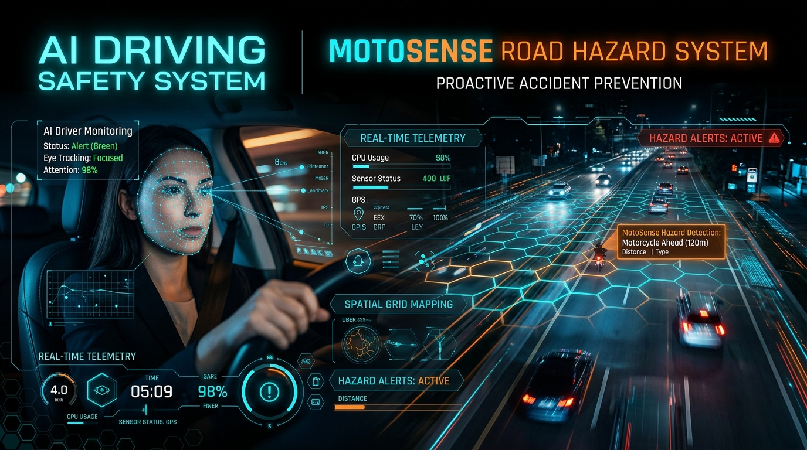
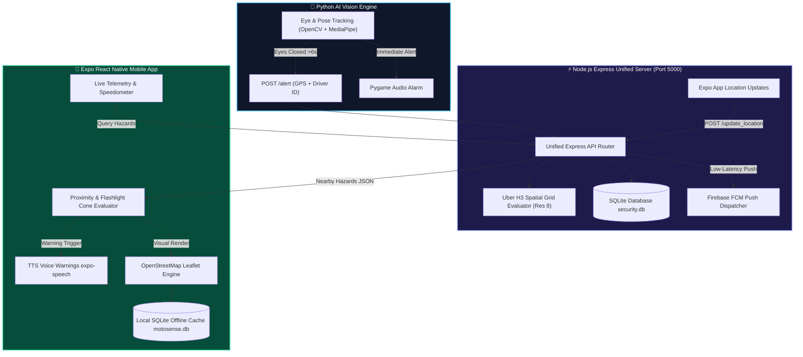
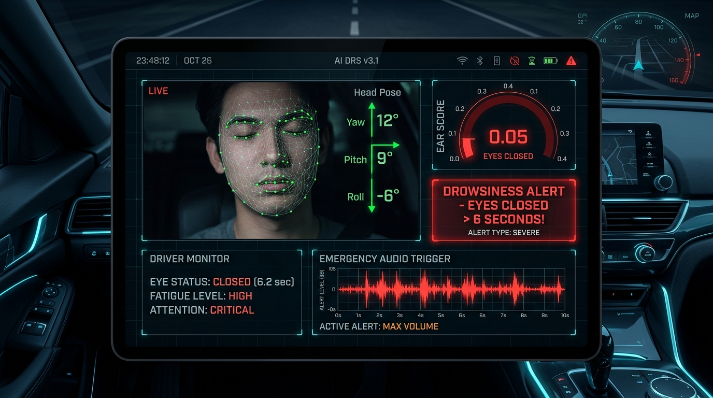
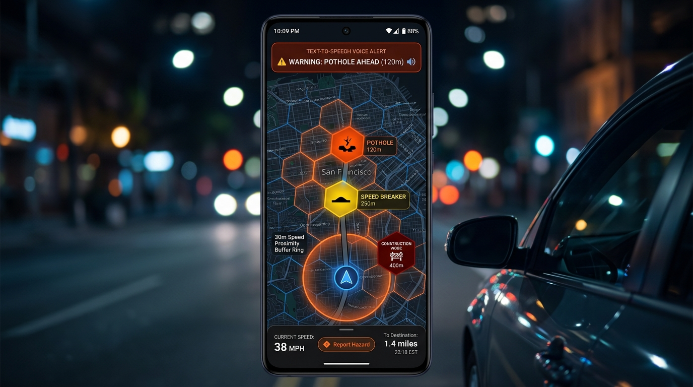

<div align="center">



# 🚨 AI Driving Safety & MotoSense Road Hazard System
### *End-to-End Computer Vision Driver Alertness Monitoring & Context-Aware Road Hazard Intelligence*

[](https://python.org)
[](https://opencv.org)
[](https://mediapipe.dev)
[](https://nodejs.org)
[](https://expressjs.com)
[](https://expo.dev)
[](https://h3geo.org)
[](https://sqlite.org)
[](https://openstreetmap.org)
[](https://firebase.google.com)

---

</div>

## 📖 Executive Summary

The **AI Driving Safety & MotoSense System** is an integrated, real-time safety network designed to eliminate highway fatigue accidents and proactively warn riders of hazardous road conditions. 

- 👁️ **Driver Monitoring**: Python AI computer vision pipeline continuously tracks facial landmarks to detect driver fatigue and sleep states (>6 seconds eyes closed).
- 🚨 **Emergency Broadcast**: Instantly broadcasts emergency alerts to nearby drivers within **<300m** and automatically dispatches GPS coordinates to local police stations (**<3km**).
- 🔷 **Uber H3 Spatial Grid**: Indexes road hazards using **Resolution 8 spatial cells** to compute aging decay stages and evaluate rider speed safety thresholds.
- 🗣️ **TTS & OpenStreetMap Integration**: Delivers real-time hands-free **Text-To-Speech (TTS)** voice warnings and displays free Leaflet map overlays without expensive proprietary map API keys.

---

## 🎨 System Architecture & Highlights



---

## 🔥 Key Visual Feature Modules

### 1. 🐍 Python AI Drowsiness Detection (`detection.py`)



> [!IMPORTANT]
> **Real-Time Fatigue Safety Guard**: Runs high-frequency 30 FPS facial tracking using OpenCV and MediaPipe 3D Face Landmarker.

* **Eye Aspect Ratio (EAR)**: Computes precise geometric distance between eyelid landmarks to accurately monitor blink duration and prolonged eye closure.
* **Head Pose Estimation (PnP)**: Detects head nodding, downward tilting, or off-road posture.
* **Local Audio Warning**: Fires instantaneous local alarm via Pygame.
* **Backend Alert Dispatch**: Automatically posts `POST /alert` with driver ID and GPS coordinates (`lat`, `lon`) when eyes remain closed for **>6 seconds**.
* **Spam Prevention / Debouncing**: Built-in 15-second cooldown timer prevents duplicate backend alert requests.

---

### 2. ⚡ Node.js Express Unified Backend & Uber H3 Engine (`backend/`)



> [!NOTE]
> **Unified Backend Infrastructure**: Single Node.js server (`http://127.0.0.1:5000`) backing both safety monitoring and spatial hazard scoring.

* **Unified SQLite Database (`db/database.js`)**: Manages `users`, `police_stations`, `alerts_log`, `fcm_tokens`, and `hazards` in `security.db` with pre-seeded demo dataset.
* **Uber H3 Spatial Grid Indexing (`services/hazardService.js`)**:
  * Converts lat/lon pairs into Uber H3 Resolution 8 spatial cells.
  * **Hazard Aging Stages (`calculate_stage`)**:
    * 🔴 **Stage 1**: Active / severe hazards (<14 days) or perpetual Road Construction zones.
    * 🟡 **Stage 2**: Aging hazards (14–30 days) or minor hazards.
    * ⚪ **Stage 3**: Historical hazards (>30 days).
  * **Rider Action Evaluator (`evaluate_rider_action`)**:
    * `FORCE_ALARM`: Mandatory audio & visual warning (Stage 1, unlit night-time hazards, or first-time riders).
    * `SPEED_GATED_ALARM`: Triggers warnings only if rider speed exceeds calculated safe thresholds.
* **Notification Engine (`services/notificationService.js`)**: Dispatches instant FCM push notifications to nearby mobile devices.

---

### 3. 📱 Expo React Native Mobile App (`mobile/`)


> [!TIP]
> **100% Free OpenSource Stack**: No Google Maps API billing required. Uses OpenStreetMap with custom Leaflet markers and offline caching.

* **Interactive OpenStreetMap (`src/components/OSMMapView.tsx`)**: Renders custom color-coded map pins:
  * 🟧 **Potholes** | 🟨 **Speed Breakers** | 🟪 **Construction Zones**
  * 🟥 **Accidents** | ⬜ **Blocked Roads** | 🛑 **Danger Zones**
  * 🚨 **Drowsy Driver** (Red marker with 300m danger perimeter ring)
  * 🔵 **Police Stations** | 🟢 **Active Users**
* **Road Hazards Manager (`src/app/hazards.tsx`)**: Crowdsource reporting interface, active hazard listings, and roadwork contractor registration/withdrawal portal.
* **Proximity & Voice Engine (`src/app/location.tsx`)**:
  * Real-time GPS speedometer telemetry.
  * Dynamic Speed Buffer: `buffer = max(30, speed * 3.5)` in meters.
  * Directional Flashlight Cone Math (±30° tolerance heading angle).
  * Text-To-Speech audio warning system using `expo-speech` (*"Warning, pothole ahead!"*).
  * Simulated Auto-Drive Mode (40 km/h route test).
* **Offline Local SQLite Caching (`src/services/db.ts`)**: Local `motosense.db` cache powered by `expo-sqlite` with browser web fallback.

---

## 📁 Project Directory Structure

```
AI_driving/
├── 📁 backend/                        # Node.js Express Unified Server
│   ├── 📁 db/
│   │   └── database.js               # SQLite connection, schema creation & demo seeding
│   ├── 📁 routes/
│   │   └── api.js                    # Express Router (/alert, /update_location, /api/hazards/*)
│   ├── 📁 services/
│   │   ├── hazardService.js          # Uber H3 spatial indexing, aging calculator & rider evaluation
│   │   └── notificationService.js     # FCM push notification service
│   ├── package.json                  # Node backend dependencies (express, h3-js, sqlite3)
│   └── server.js                     # Main Node.js Express server entrypoint
│
├── 📁 mobile/                         # Expo React Native Mobile Application
│   ├── app.json                      # Expo application configuration
│   ├── metro.config.js               # Metro bundler config (with .wasm asset support)
│   ├── package.json                  # React Native & Expo dependencies (expo-speech, expo-sqlite)
│   └── 📁 src/
│       ├── 📁 api/
│       │   └── config.ts             # API endpoints & fetch helpers for drowsiness & hazards
│       ├── 📁 components/
│       │   └── OSMMapView.tsx        # Interactive OpenStreetMap Leaflet component
│       ├── 📁 services/
│       │   └── db.ts                 # Local SQLite offline hazard caching (motosense.db)
│       └── 📁 app/
│           ├── _layout.tsx           # Navigation tab bar configuration
│           ├── index.tsx             # Dashboard & SOS emergency alert button
│           ├── hazards.tsx           # Road Hazards management & crowdsource reporting screen
│           ├── location.tsx          # Live GPS telemetry, dynamic buffer & TTS voice engine
│           ├── map.tsx               # Live OpenStreetMap alert & hazard visualization
│           ├── history.tsx           # Historical alert log screen
│           └── notifications.tsx     # Push notification feed & FCM manager
│
├── 📁 docs/assets/                    # Visual Assets & Screenshots
│   ├── hero_banner.jpg               # High-tech project header banner
│   ├── drowsiness_hud.jpg            # AI Face mesh HUD visual
│   ├── motosense_map_ui.jpg          # MotoSense map UI visual
│   └── alert_network_ui.jpg          # Emergency alert network visual
│
├── 📁 MotoSenseProject/               # MotoSense baseline reference module
├── 🐍 detection.py                    # OpenCV + MediaPipe face landmarker drowsiness detector
├── 🎵 alarm.wav                       # Local alarm audio file
├── 🧠 face_landmarker.task            # MediaPipe 3D face landmarker model
├── 📄 requirements.txt                # Python dependencies
├── 🚫 .gitignore                      # Excludes node_modules, venv, .expo, .db files
└── 📘 README.md                       # Main project documentation
```

---

## 🚀 Step-by-Step Execution Guide

### 🛠️ Prerequisites
| Requirement | Recommended Version |
| :--- | :--- |
| **Node.js** | `v18.0.0` or higher |
| **Python** | `3.9` or higher |
| **NPM** | `v9.0.0` or higher |

---

### Step 1: Launch Node.js Backend Server

Open terminal in the project root:

```bash
cd backend
npm install
node server.js
```

*Expected Terminal Output:*
```text
Connected to SQLite database: security.db
Seeded demo users, police stations, and road hazards into SQLite.
🚀 Unified Node.js Express Backend running on http://127.0.0.1:5000
```

---

### Step 2: Launch Mobile App (Expo)

Open a **second terminal** window:

```bash
cd mobile
npm install
npx expo start
```

* **`w`**: Open in Web Browser.
* **`a`**: Open in Android Emulator (`http://10.0.2.2:5000`).
* **Scan QR Code**: Use **Expo Go** app on iOS or Android device.

---

### Step 3: Run AI Drowsiness Detection

Open a **third terminal** window:

```bash
pip install -r requirements.txt
python detection.py
```

* 👁️ **Triggering Alert**: Close eyes for **>6 seconds** to fire the local audio alarm and automatically send `POST /alert` to the Express backend.
* ⌨️ **Controls**: Press **`q`** to safely close the webcam feed window.

---

## 🌐 API Endpoints Reference

| Method | Endpoint | Description | Key Payload / Query |
| :---: | :--- | :--- | :--- |
| `GET` | `/health` | Server health check endpoint | None |
| `POST` | `/alert` | Dispatches driver drowsiness alert | `{ driver_id, lat, lon }` |
| `POST` | `/update_location` | Updates continuous rider location | `{ user_id, lat, lon, name, phone }` |
| `POST` | `/register_token` | Registers FCM token for push notifications | `{ user_id, fcm_token }` |
| `GET` | `/history` | Fetches historical alert log | None |
| `GET` | `/users` | Lists active users in security DB | None |
| `GET` | `/police` | Lists police stations in security DB | None |
| `POST` | `/api/hazards/crowdsource` | Submits crowdsourced road hazard | `{ latitude, longitude, type, initial_severity, is_lit }` |
| `POST` | `/api/hazards/construction/register` | Contractor registers active road work | `{ latitude, longitude, company_name, is_lit }` |
| `POST` | `/api/hazards/construction/withdraw` | Withdraws active construction zone | `{ hazard_id }` |
| `GET` | `/api/hazards/nearby` | Queries nearby hazards evaluated by Uber H3 Res 8 | `?lat=...&lon=...&speed=...` |

---

## 🛠️ Verification & Quality Assurance Summary

1. **Database Auto-Seeding**: Automatic creation and seeding of `backend/security.db` with demo users, police stations, and hazards.
2. **Uber H3 Spatial Indexing**: Verified Resolution 8 coordinate conversion and grid neighbor queries.
3. **Proximity Telemetry Engine**: Validated speed buffer calculation (`max(30, speed * 3.5)`), directional cone (±30°), and `expo-speech` TTS warnings.
4. **TypeScript Verification**: Clean zero-error compilation validated via `npx tsc --noEmit`.

---

<div align="center">

*Developed for AI Driving Safety & MotoSense Unified Engineering Project.*

</div>
