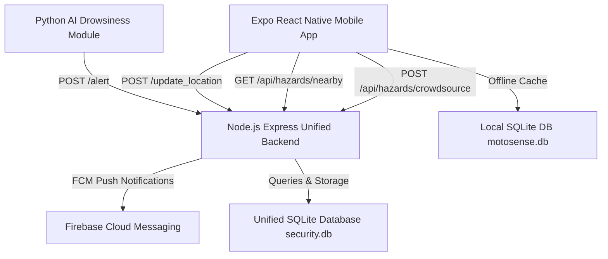

# Integration & Completion Plan: MotoSense Road Hazard Module & AI Driving Safety System

This plan outlines the architecture, consolidation, and step-by-step implementation for integrating the **MotoSense Road Hazard Module** (`MotoSenseProject`) into the existing **AI Driving Safety System**.

## System Overview & Architecture

The final unified system consists of 3 synchronized tiers:

---

## User Review Required

> [!IMPORTANT]
> **Backend Consolidation Choice**: We are consolidating all backend services into the **Node.js / Express** server (`backend/server.js`) running on port `5000`. It will handle all Drowsiness Alert endpoints, User GPS updates, FCM push notifications, SQLite database persistence, and the new Uber H3 spatial hazard evaluation endpoints (`/api/hazards/*`).
> 
> **Database Architecture**: SQLite (`backend/security.db`) will serve as the primary server database storing `users`, `police_stations`, `alerts_log`, `fcm_tokens`, and `hazards`. The mobile app will use `expo-sqlite` for local offline hazard caching (`motosense.db`) so hazard warnings continue working even with intermittent connectivity.

---

## Proposed Changes

### Backend Component (`backend/`)

#### [MODIFY] [package.json](file:///c:/Users/Ankur/Desktop/AI_driving/backend/package.json)
- Add dependencies: `better-sqlite3`, `h3-js`, `@supabase/supabase-js`.

#### [MODIFY] [server.js](file:///c:/Users/Ankur/Desktop/AI_driving/backend/server.js)
- Expand Express server to load all routes, middlewares, error handlers, and database initializations.

#### [NEW] [database.js](file:///c:/Users/Ankur/Desktop/AI_driving/backend/db/database.js)
- Unified SQLite database helper using `better-sqlite3` or `sqlite3`.
- Creates and manages schemas: `users`, `police_stations`, `alerts_log`, `fcm_tokens`, and `hazards`.
- Seeds initial demo data for users, police stations, and road hazards (potholes, speed breakers, road construction, accidents, blocked roads, danger zones).

#### [NEW] [hazardService.js](file:///c:/Users/Ankur/Desktop/AI_driving/backend/services/hazardService.js)
- Uber H3 spatial indexing (`h3-js` resolution 8).
- Implements hazard aging stage calculation (`calculate_stage`), lighting/night-time context rules, and rider decision evaluation (`evaluate_rider_action`: `FORCE_ALARM` vs `SPEED_GATED_ALARM`).

#### [NEW] [notificationService.js](file:///c:/Users/Ankur/Desktop/AI_driving/backend/services/notificationService.js)
- Unified Firebase Admin FCM push notification module supporting both drowsiness alerts and nearby hazard warnings.

#### [NEW] [api.js](file:///c:/Users/Ankur/Desktop/AI_driving/backend/routes/api.js)
- Express Router containing:
  - `POST /alert` (Drowsiness alert from Python AI)
  - `POST /update_location` (User GPS sync every 5s)
  - `POST /register_token` (FCM push token registration)
  - `GET /history` (Alert history log)
  - `GET /users` & `GET /police`
  - `GET /health`
  - `POST /api/hazards/crowdsource` (Report pothole, speed breaker, accident, blocked road, danger zone)
  - `POST /api/hazards/construction/register`
  - `POST /api/hazards/construction/withdraw`
  - `GET /api/hazards/nearby` (Fetch & evaluate nearby hazards against H3 grid & rider context)

---

### Python AI Module (`detection.py` & `app.py`)

#### [MODIFY] [detection.py](file:///c:/Users/Ankur/Desktop/AI_driving/detection.py)
- Verify endpoint target (`http://127.0.0.1:5000/alert`) and smooth fallback when audio/network is offline.

#### [MODIFY] [app.py](file:///c:/Users/Ankur/Desktop/AI_driving/app.py)
- Ensure root launcher starts the Node.js backend server cleanly.

---

### Mobile Application (`mobile/`)

#### [MODIFY] [package.json](file:///c:/Users/Ankur/Desktop/AI_driving/mobile/package.json)
- Add `expo-speech` and `expo-sqlite`.

#### [NEW] [db.ts](file:///c:/Users/Ankur/Desktop/AI_driving/mobile/src/services/db.ts)
- Offline SQLite local database manager (`motosense.db`) using `expo-sqlite`.
- Stores `local_hazards` table and syncs with backend `/api/hazards/nearby`.

#### [MODIFY] [config.ts](file:///c:/Users/Ankur/Desktop/AI_driving/mobile/src/api/config.ts)
- Update TypeScript types and API helper functions (`HazardItem`, `CrowdsourceHazardPayload`, `fetchNearbyHazardsApi`, `reportHazardApi`, `withdrawConstructionApi`).

#### [MODIFY] [_layout.tsx](file:///c:/Users/Ankur/Desktop/AI_driving/mobile/src/app/_layout.tsx)
- Add "Hazards" tab item to bottom navigation tab bar.

#### [MODIFY] [index.tsx](file:///c:/Users/Ankur/Desktop/AI_driving/mobile/src/app/index.tsx)
- Integrate Quick Hazard Report modal/shortcut, system stats for active hazards, and live backend connection badge.

#### [NEW] [hazards.tsx](file:///c:/Users/Ankur/Desktop/AI_driving/mobile/src/app/hazards.tsx)
- Comprehensive Road Hazards screen allowing users to:
  - Report new road hazards (Potholes, Speed Breakers, Construction, Accidents, Blocked Roads, Danger Zones) with severity & lighting parameters.
  - View all nearby active hazards with status & distance.
  - Withdraw construction hazards.

#### [MODIFY] [map.tsx](file:///c:/Users/Ankur/Desktop/AI_driving/mobile/src/app/map.tsx) & [OSMMapView.tsx](file:///c:/Users/Ankur/Desktop/AI_driving/mobile/src/components/OSMMapView.tsx)
- Render custom Leaflet/OSM map markers for:
  - Drowsy driver location & 300m danger circle.
  - Police stations & 3km police net circle.
  - Nearby users.
  - **Road Hazards**: Potholes (orange), Speed Breakers (yellow), Construction (purple), Accidents (red), Blocked Roads (grey), Danger Zones (dark red).
- Map popups displaying hazard stage, severity, and distance.

#### [MODIFY] [location.tsx](file:///c:/Users/Ankur/Desktop/AI_driving/mobile/src/app/location.tsx)
- Full Live Tracking & Proximity Engine integration:
  - Real-time speedometer.
  - Dynamic Warning Buffer based on speed: `buffer = max(30, (speed * 3.5))`.
  - Directional Flashlight Cone Math (±30° tolerance angle).
  - Text-To-Speech audio warnings using `expo-speech` ("Warning, pothole ahead").
  - Route Builder Demo Mode (tap map to draw route, auto-drive at 40 km/h simulation).

#### [MODIFY] [notifications.tsx](file:///c:/Users/Ankur/Desktop/AI_driving/mobile/src/app/notifications.tsx)
- Support notifications for both Drowsiness Alerts and Road Hazard Alerts.

---

## Verification Plan

### Automated & Unit Checks
- Run `npm test` or syntax verification on backend scripts.
- Run `npx tsc --noEmit` inside `mobile/` to verify zero TypeScript errors.

### Manual End-to-End Testing
1. **Backend Verification**:
   - Start Node.js backend: `node server.js`
   - Test `/health`, `/alert`, `/update_location`, `/api/hazards/nearby`, `/api/hazards/crowdsource` via HTTP curl/fetch tests.
2. **Python AI Module**:
   - Run `python detection.py` and test face detection, EAR drowsiness triggering, local alarm audio, and HTTP alert dispatch.
3. **Mobile Application**:
   - Run `npx expo start` in `mobile/`.
   - Test Dashboard, Hazards reporting screen, OSM Map with hazard markers, Live GPS with Speech voice alerts, and Route Builder simulation mode.
